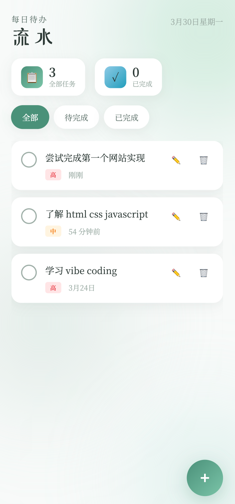
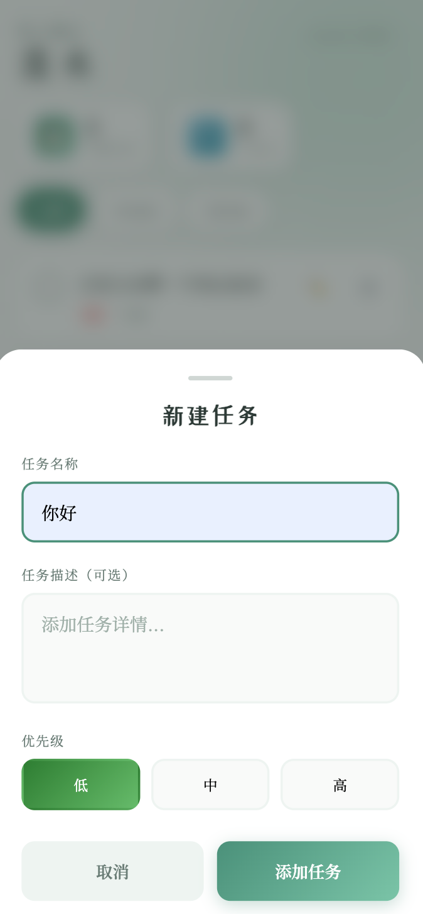
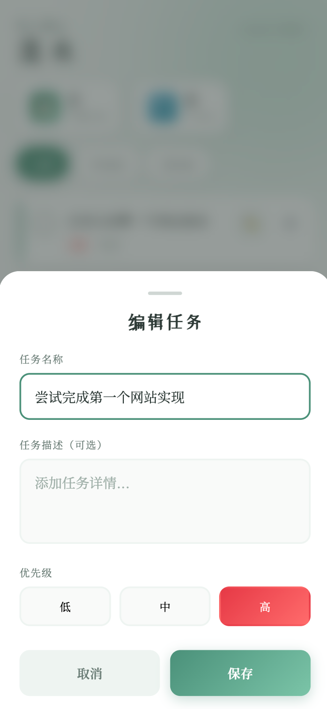

# 流水待办列表 — 前端编码技术入门

> 一个纯 HTML + CSS + JavaScript 的待办事项应用，不需要任何框架，适合前端初学者练手。

---

## 一、项目概述

这是一个可以在**手机和电脑浏览器**中直接使用的待办事项管理工具：

- 添加、完成、删除任务
- 编辑修改已有任务
- 按优先级分类（高/中/低）
- 筛选任务（全部/待完成/已完成）
- 数据保存到本地，刷新不丢失
- 响应式设计，手机和电脑都能用






**技术选型**：纯 HTML + CSS + JavaScript，单文件实现，无任何外部依赖。

---

## 二、文件结构

这个项目只有一个文件：

```
todolist.html     ← 包含 HTML + CSS + JavaScript 的全部代码
```

打开方式：直接用浏览器打开这个文件即可运行。

---

## 三、HTML 结构（页面骨架）

HTML 决定了"页面有什么"，也就是**内容层**。

### 3.1 最基本的 HTML 骨架

```html
<!DOCTYPE html>
<html>
<head>
    <meta charset="UTF-8">
    <title>我的网页</title>
</head>
<body>
    <!-- 页面内容写在这里 -->
</body>
</html>
```

- `<!DOCTYPE html>` — 告诉浏览器用标准模式解析
- `<head>` — 放页面元信息，浏览器看得见但用户看不见
- `<body>` — 放实际显示的内容

### 3.2 我们的页面结构

```html
<body>
    <!-- 背景装饰 -->
    <div class="bg-decoration">...</div>

    <!-- 主应用区域 -->
    <div class="app">
        <!-- 顶部区域：标题 + 统计 -->
        <header class="header">...</header>

        <!-- 中间区域：任务列表 -->
        <main class="main">...</main>
    </div>

    <!-- 右下角添加按钮 -->
    <div class="fab-container">
        <button class="fab">+</button>
    </div>

    <!-- 弹出表单（默认隐藏） -->
    <div class="modal">...</div>
</body>
```

**关键概念**：

- `class` — 给元素起名字，方便 CSS 和 JS 找到它
- `header` / `main` / `button` — 语义化标签，含义自解释

---

## 四、CSS 样式（视觉设计）

CSS 决定了"内容长什么样"，也就是**表现层**。

### 4.1 CSS 在哪里写

两种方式：

```html
<!-- 方式一：写在 head 里（这次用的方式） -->
<head>
    <style>
        body { background: #f8faf9; }
    </style>
</head>

<!-- 方式二：写在标签的 style 属性里（不推荐） -->
<div style="background: red;">内容</div>
```

### 4.2 选择器：怎么选中要装饰的元素

```css
/* 按 class 选中（前面加点） */
.fab { width: 60px; height: 60px; }

/* 按标签名选中（前面没东西） */
button { cursor: pointer; }

/* 按 id 选中（前面加井号） */
#taskList { display: flex; }

/* 组合：class 为 fab 的 button */
button.fab { border-radius: 50%; }
```

### 4.3 盒模型：每个元素都是一个盒子

```
┌─────────────────────────────┐  ← margin（外边距）
│  ┌───────────────────────┐  │  ← border（边框）
│  │  ┌─────────────────┐  │  │  ← padding（内边距）
│  │  │     内容文字      │  │  │
│  │  └─────────────────┘  │  │
│  └───────────────────────┘  │
└─────────────────────────────┘
```

### 4.4 Flexbox 布局：让元素排列整齐

**问题**：一个容器里有多个元素，怎么让它们对齐？

**答案**：Flexbox（弹性盒子）

```css
/* 开启 Flexbox */
.container {
    display: flex;
}

/* 主轴方向：水平排列（默认） */
flex-direction: row;

/* 主轴对齐：水平居中 */
justify-content: center;

/* 交叉轴对齐：垂直居中 */
align-items: center;

/* 元素之间的间距 */
gap: 12px;
```

图示：

```
          justify-content: center（主轴）
                    ↓
    ┌────┐  ┌────┐  ┌────┐  → flex-direction: row
    │ 1  │  │ 2  │  │ 3  │
    └────┘  └────┘  └────┘
                    ↑
            align-items: center（交叉轴）
```

### 4.5 CSS 变量：统一管理颜色和尺寸

```css
:root {
    --bg-primary: #f8faf9;        /* 主背景色 */
    --accent-primary: #4a9079;    /* 主题色 */
    --radius-lg: 24px;           /* 大圆角 */
}

body {
    background: var(--bg-primary);
}

.fab {
    border-radius: var(--radius-lg);
}
```

好处：**改一处，全局生效**。

### 4.6 动画：让页面动起来

```css
/* 定义动画 */
@keyframes fadeIn {
    from { opacity: 0; transform: translateY(20px); }
    to { opacity: 1; transform: translateY(0); }
}

/* 使用动画 */
.task-item {
    animation: fadeIn 0.5s ease-out;
}
```

关键帧 `from` 是开始状态，`to` 是结束状态，中间浏览器自动补全。

---

## 五、JavaScript 逻辑（行为交互）

JavaScript 决定了"内容和用户怎么互动"，也就是**行为层**。

### 5.1 JS 在哪里写

```html
<!-- 方式一：写在 body 末尾（这次用的方式） -->
<body>
    ...
    <script>
        console.log('Hello World');
    </script>
</body>

<!-- 方式二：写在外部文件 -->
<script src="main.js"></script>
```

### 5.2 变量：存储数据

```javascript
let name = '小明';        // let：可变变量
const PI = 3.14159;      // const：常量，不可变

let count = 0;
count = count + 1;        // OK，count 变成 1

let tasks = [];           // 数组：存放多个任务
tasks.push({ title: '吃饭' });  // 添加一个任务
```

### 5.3 函数：封装一段可复用的代码

```javascript
// 定义函数
function sayHello(name) {
    return '你好，' + name;
}

// 调用函数
let message = sayHello('小明');
console.log(message);  // 输出：你好，小明

// 另一种写法（箭头函数）
const sayHello = (name) => '你好，' + name;
```

### 5.4 DOM：把 HTML 当成一棵树

浏览器把 HTML 转成 JavaScript 可以操作的对象，叫 **DOM（Document Object Model）**。

```
document（根）
  └── body
        └── div.app
              ├── header.header
              │     └── h1.title
              └── main.main
                    └── div.task-list
                          └── div.task-item
```

**找元素**：

```javascript
const fab = document.getElementById('fabButton');    // 按 ID 找
const tasks = document.querySelectorAll('.task-item'); // 按选择器找
```

**读和改**：

```javascript
// 读取内容
const title = taskTitleInput.value;

// 修改样式
modal.classList.add('active');    // 添加 class
modal.classList.remove('active'); // 移除 class
modal.classList.toggle('active'); // 切换 class
```

### 5.5 事件监听：响应用户操作

**问题**：用户点了按钮，我怎么知道？

**答案**：监听事件

```javascript
// 当用户点击按钮时，执行 openModal 函数
fabButton.addEventListener('click', openModal);

// 当表单提交时，执行 handleSubmit 函数
taskForm.addEventListener('submit', handleSubmit);

// 事件对象 e
button.addEventListener('click', function(e) {
    console.log(e.target);  // e.target 是被点击的元素
});
```

常见事件：`click`（点击）、`submit`（表单提交）、`input`（输入）、`touchend`（触摸结束）

### 5.6 LocalStorage：把数据存在浏览器里

```javascript
// 存数据（转成字符串）
localStorage.setItem('tasks', JSON.stringify(tasks));

// 取数据
const saved = localStorage.getItem('tasks');
tasks = JSON.parse(saved);  // 转回对象

// 删数据
localStorage.removeItem('tasks');
```

**为什么需要转成字符串？** — LocalStorage 只能存字符串，所以对象要 `JSON.stringify` 序列化，取出来要 `JSON.parse` 反序列化。

### 5.7 完整的数据流

**新建任务**：

```
用户点击"+"按钮
        ↓
触发 click 事件，openModal 被调用
        ↓
表单弹出来，聚焦到输入框
        ↓
用户填写内容，点击"添加任务"
        ↓
handleSubmit 被调用
        ↓
读取表单内容，构造任务对象
        ↓
添加到 tasks 数组（unshift，新任务在前面）
        ↓
保存到 localStorage
        ↓
重新渲染任务列表
        ↓
页面更新，Toast 提示"任务添加成功"
```

**编辑任务**：

```
用户点击任务的"✏️"按钮
        ↓
触发 click 事件，editTask 被调用
        ↓
找到对应任务，把数据填入表单
        ↓
表单标题变成"编辑任务"，按钮变成"保存"
        ↓
表单弹出来
        ↓
用户修改内容，点击"保存"
        ↓
handleSubmit 被调用（此时 editingTaskId 不为空）
        ↓
找到原任务，更新它的 title / desc / priority
        ↓
保存到 localStorage
        ↓
重新渲染任务列表
        ↓
页面更新，Toast 提示"任务已保存"
```

**关键区别**：新建和编辑共用同一个表单，通过 `editingTaskId` 变量区分：
- `editingTaskId` 为 `null` → 新建
- `editingTaskId` 有值 → 编辑

---

## 六、响应式设计核心

让同一个页面在手机和电脑上都好看。

### 6.1 viewport：告诉浏览器这是移动端页面

```html
<meta name="viewport" content="width=device-width, initial-scale=1.0">
```

没有这行，手机浏览器会默认把页面缩放成 PC 的宽度，导致字很小。

### 6.2 移动端优先的布局思路

```css
/* 默认是手机样式（单列布局） */
.task-item {
    flex-direction: column;
    padding: 12px;
}

/* 当屏幕宽度 >= 768px 时，应用这套样式 */
@media (min-width: 768px) {
    .task-item {
        flex-direction: row;
        padding: 16px;
    }
}
```

### 6.3 安全区域：适配刘海屏

```css
/* 确保内容不被刘海和圆角遮住 */
padding: env(safe-area-inset-top) env(safe-area-inset-right)
         env(safe-area-inset-bottom) env(safe-area-inset-left);
```

### 6.4 移动端的特殊处理

```css
/* 禁止长按弹出菜单 */
button { -webkit-tap-highlight-color: transparent; }

/* 禁止选中文字 */
* { -webkit-user-select: none; user-select: none; }
```

---

## 七、动手改一改

学完了，来点小练习：

### 练习 1：改颜色

找到 CSS 的 `:root` 部分，修改 `--accent-primary` 的值，换成你喜欢的颜色。

### 练习 2：加一个功能

在任务里加上"截止日期"字段。提示：

1. 在 HTML 的表单里加一个 `<input type="date">`
2. 在 JS 的 `handleSubmit` 里读取这个值
3. 在渲染任务时显示日期

---

## 八、文件位置

- 源码：项目根目录下 `todolist.html`
- 线上预览：https://liushui-todolist.netlify.app

---

*关于部署上线的详细说明，见另一篇文档《静态网站部署实战》。*
